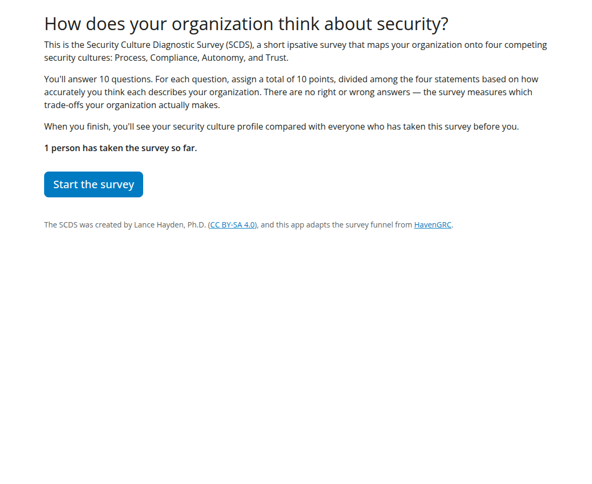
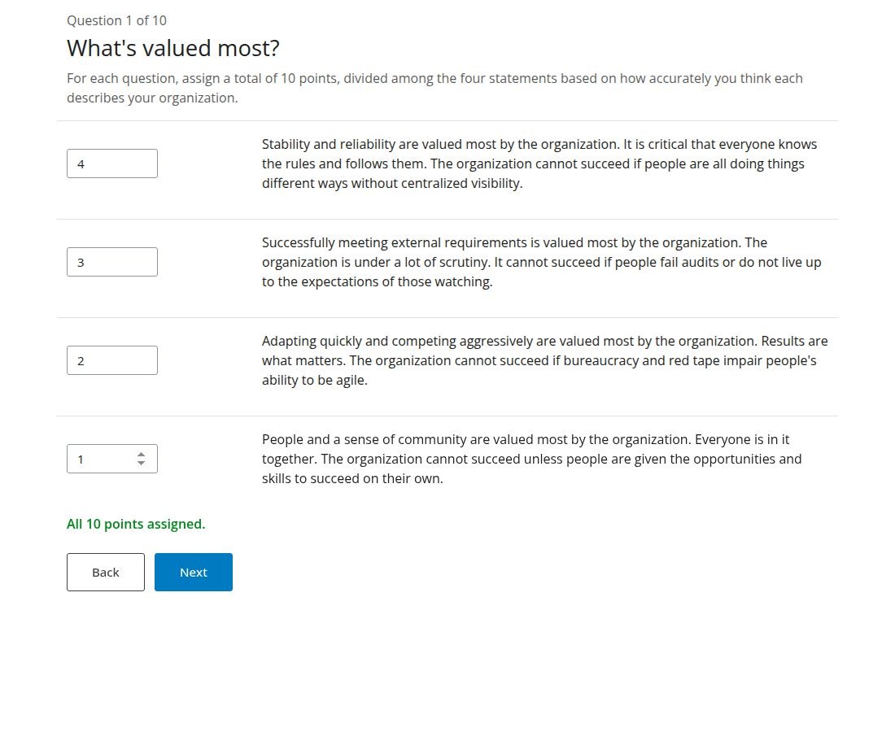
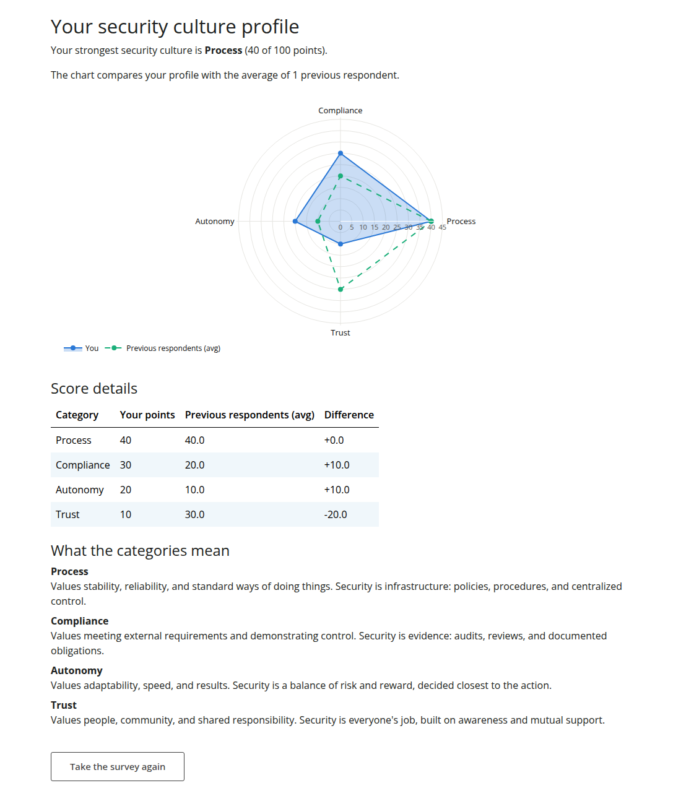

# Security Culture Survey

A [Shiny for Python](https://shiny.posit.co/py/) app that presents the
ipsative **Security Culture Diagnostic Survey (SCDS)** — the landing-funnel
survey from [HavenGRC](https://github.com/kindlyops/havengrc) — and shows each
respondent how their security culture profile compares with everyone who
answered before them.

Respondents answer 10 questions, assigning 10 points per question across four
statements. Each statement corresponds to one of the four competing security
cultures: **Process**, **Compliance**, **Autonomy**, and **Trust**. After
submitting, the respondent sees a radar chart and score table of their
category totals overlaid with the running average of all previous respondents.

## Screenshots

### Landing page

Visitors see what the survey measures and how many people have taken it.



### Survey questions

Each question presents four unlabeled statements; the respondent divides 10
points among them, with live feedback on the points remaining.



### Results

The respondent's category totals are drawn over the running average of all
previous respondents, with a score table and category explanations.



## Layout

| File | Purpose |
| --- | --- |
| `app.py` | The Shiny app: landing page → 10-question wizard → results comparison |
| `scds.py` | The SCDS survey content, ported verbatim from HavenGRC's `flyway/sql/V5__ipsative_data.sql` |
| `db.py` | SQLAlchemy persistence layer for responses |
| `requirements.txt` | Python dependencies |
| `manifest.json` | Deployment manifest for git-backed publishing to Posit Connect |
| `tests/` | Playwright end-to-end test of the full survey funnel (also regenerates the README screenshots) |
| `.github/workflows/tests.yml` | CI: runs the end-to-end tests on every pull request |

## Data storage: the Connect per-content database

On Posit Connect the app stores responses in the **per-content database**: a
Postgres database Connect provisions for this content item and exposes to the
running process as `CONNECT_CONTENT_DATABASE_URL`. `db.py` reads that variable
and connects through SQLAlchemy with the bundled `psycopg` driver
(`postgres://`-scheme URLs are normalized automatically).

When no database URL is present in the environment (e.g. local development),
responses fall back to a local `scds_responses.sqlite3` file in the working
directory. On Connect this fallback would not survive redeploys, which is
exactly what the per-content database is for.

The schema is a single table, `scds_responses`, created on first use: one row
per (submission, question, category) with the points assigned.

## Run locally

```bash
python -m venv .venv && .venv/bin/pip install -r requirements.txt
.venv/bin/shiny run app.py
```

## Run the tests

The end-to-end test starts the app against a temporary SQLite database seeded
with one prior respondent, then drives the whole funnel with Playwright —
including the point-allocation validation and the results comparison. It also
rewrites the screenshots in `screenshots/` used by this README.

```bash
.venv/bin/pip install -r requirements-dev.txt
.venv/bin/playwright install chromium
.venv/bin/pytest
```

The same suite runs in GitHub Actions on every pull request.

## Deploy to Posit Connect

With the [rsconnect-python](https://docs.posit.co/rsconnect-python/) CLI:

```bash
rsconnect deploy shiny . --title "Security Culture Survey"
```

Or use git-backed deployment: Connect can deploy this repository directly
using the checked-in `manifest.json`. Regenerate it after changing
dependencies or files:

```bash
rsconnect write-manifest shiny . --overwrite \
  --exclude README.md --exclude .gitignore --exclude requirements-dev.txt \
  --exclude "tests/**" --exclude "screenshots/**" --exclude ".github/**" \
  --exclude ".venv/**" --exclude "__pycache__/**" \
  --exclude ".pytest_cache/**" --exclude ".claude/**"
```

After deploying, enable the per-content database for the content item (or set
the appropriate environment variable pointing at a database), and set access
so that viewers can open the app. All responses are anonymous — no user
identity is recorded.

## Attribution

The SCDS instrument was created by **Lance Hayden, Ph.D.** and is licensed
under [CC BY-SA 4.0](https://creativecommons.org/licenses/by-sa/4.0/). The
survey funnel design and question data come from
[kindlyops/havengrc](https://github.com/kindlyops/havengrc) and
[kindlyops/elm-survey-prototype](https://github.com/kindlyops/elm-survey-prototype).
